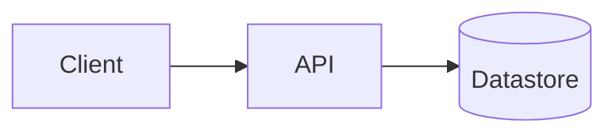

# {{PROJECT_NAME}} — Agent Guide

> Read me first. This file is the shared briefing for any human or agent
> working in this repo. Deeper docs live under [`docs/forge/`](docs/forge/).
> Read those only when the current task requires them.

## What is {{PROJECT_NAME}}?

{{PROJECT_GOAL}}

## Architecture quick view

Replace this diagram with the real one. Keep it small enough to read at a
glance — a full diagram and component breakdown belongs in
[`docs/forge/ARCHITECTURE.md`](docs/forge/ARCHITECTURE.md).

## Tech stack

{{TECH_STACK}}

## Repo layout

{{REPO_LAYOUT}}

## Conventions (summary)

The full versions live in `.cursor/rules/` (or your IDE's equivalent).
Highlights:

- **Branches** — feature branches only; never work directly on the release
  branch.
- **Commits** — Conventional Commits (`feat(scope): …`, `fix(scope): …`).
- **Reviews** — every governed task PR/MR needs one approval and a green
  pipeline before merge.

## Working a task

1. Read `docs/forge/AI.md` (config) and `docs/forge/CONTEXT.md` (context
   budget).
2. Pick one task from `docs/forge/TASKS.index.yaml` (or the configured task
   source). Confirm `file_scope` and acceptance criteria.
3. Cut a task branch.
4. Implement only within declared `file_scope`. Update shared contract files
   in the same change.
5. Add or update tests.
6. Open a PR/MR. Wait for review and a green pipeline before merging.

## Role split

{{ROLE_SPLIT}}

## FORGE moments

- plan / break down work → `forge-plan`
- implement / build / fix → `forge-build` (review gates run in the loop)
- review / "is this done" → `forge-review`
- merge / release / promote → `forge-ship`
- lessons → `forge-memory`

## Where to look when stuck

- Architecture / constraints → [`docs/forge/ARCHITECTURE.md`](docs/forge/ARCHITECTURE.md)
- Task list / scope → [`docs/forge/TASKS.index.yaml`](docs/forge/TASKS.index.yaml)
- Team / branch / claim rules → [`docs/forge/TEAM.md`](docs/forge/TEAM.md)
- Security expectations → [`docs/forge/SECURITY_CHECKLISTS.md`](docs/forge/SECURITY_CHECKLISTS.md) or `docs/forge/security-checklists/`
- Lessons / decisions → [`docs/forge/MEMORY.md`](docs/forge/MEMORY.md) or `docs/forge/memory/`
- Setup / onboarding → [`docs/forge/SETUP.md`](docs/forge/SETUP.md)

## Context discipline

- Do not auto-load all `docs/forge/*` files at session start.
- Read `TEAM.md`, `ARCHITECTURE.md`, `MEMORY.md`, `SECURITY_CHECKLISTS.md`,
  `SETUP.md`, and `EVALUATION.md` only when the current task needs them.
- Keep working responses terse and implementation-focused.
