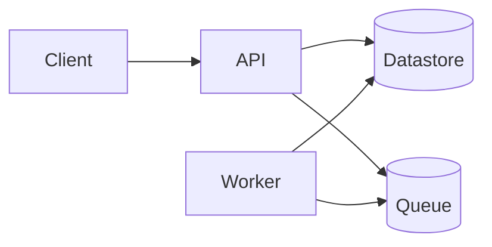

# Architecture

## Overview

Replace this paragraph with one or two sentences describing the system shape:
the major components, what they own, and how they communicate.

## Quick view

Replace the diagram above with the real one. Keep it small enough to read at
a glance; deeper component breakdowns belong below or in dedicated sub-docs.

## Components

- Component:
  - Owns:
  - Talks to:
  - Trust level:

## Constraints

Document only the project-specific architectural constraints that should
shape implementation decisions.

- Constraint:

## Contract Artifacts

List shared interface files that must stay aligned across implementation
boundaries, for example OpenAPI, protobuf, GraphQL schema, AsyncAPI,
generated client config, or database migration contracts.

- Contract file:
- Owners:
- Rule: API, client, or integration-boundary changes must update the
  relevant contract file in the same task, PR, or MR unless the task
  explicitly records a separate owner and link for the contract change.

## Trust Boundaries

- Boundary:
  - Who crosses it:
  - What is authenticated:
  - What is authorized:
